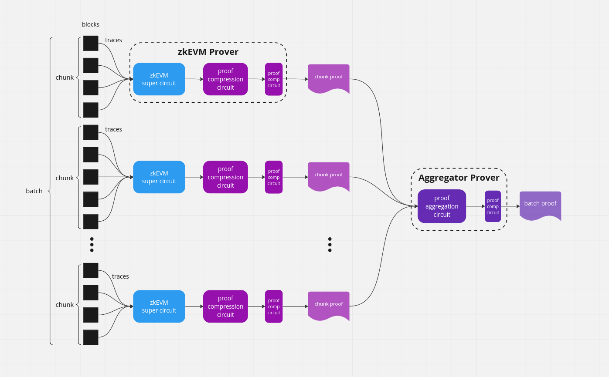

Proof Aggregation
-----

This repo does proof aggregations for zkEVM proofs.

## zkEVM circuit
A zkEVM circuits generates a ZK proof for a chunk of blocks. It takes 64 field elements as its public input, consist of 
- chunk's data hash digest
- chunk's public input hash digest
Each hash digest is decomposed into 32 bytes, and then casted as 32 field elements.

For the ease of testing, this repo implements a `MockCircuit` which hash same public input APIs as a zkEVM circuit. 

## Compression circuit
A compression circuit takes in a snark proof and generates a new (potentially small) snark proof. 
It re-expose the same public inputs as the original circuit.

## Aggregation circuit
An aggregation circuit takes in a batch of proofs, each for a chunk of blocks. 
It generates a single proof asserting the validity of all the proofs. 
It also performs public input aggregation, i.e., reducing the 64 public elements per proof into a fixed number of elements:
- 12 elements from accumulators
- 132 elements from the hashes
See [public input aggregation](./src/proof_aggregation/public_input_aggregation.rs) for the details of public input aggregation.
