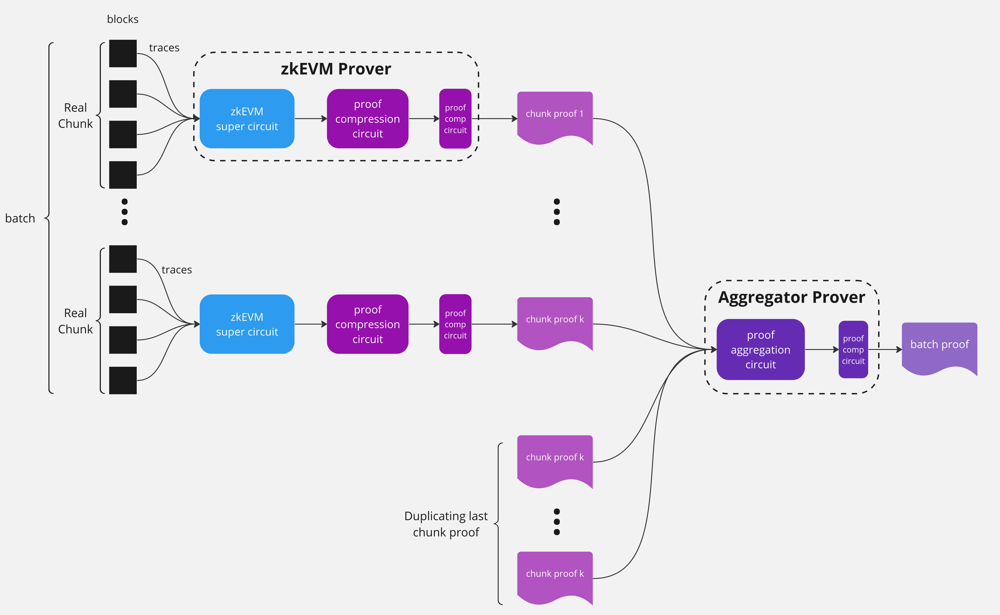
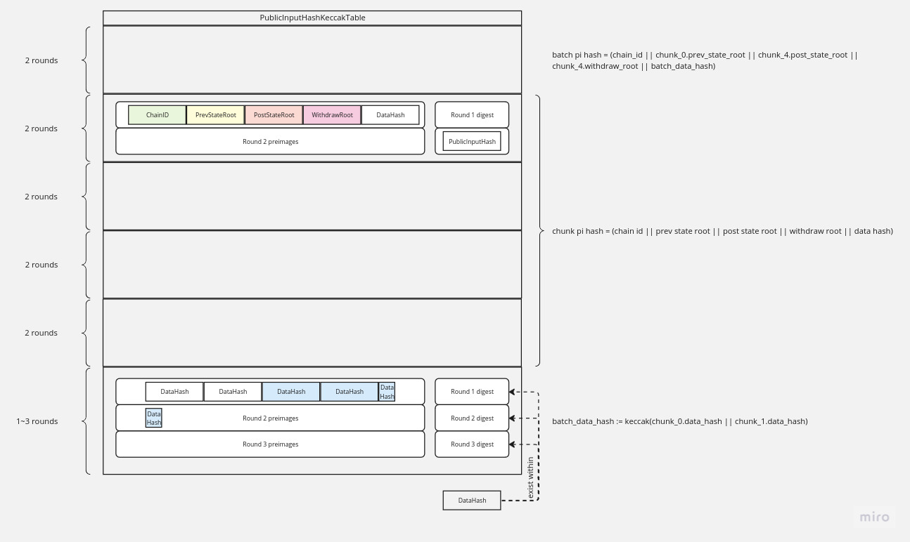

Proof Aggregation
-----

# Mechanism
Aggregation allows larger amounts of data to be verified on-chain using fewer proofs.
Currently, chunks (a list of continuous blocks) are first aggregated into a batch, then multiple batches are aggregated using a recursive scheme into a bundle.
The `bundle` is the current apex entity that will be verified on-chain. 

<!--  -->
# Params
|param|meaning |
|:---:|:---|
|k | number of valid chunks|
|n | max number of chunks per batch (hard-coded)|
|t | number of rounds for the final hash $\lceil32\times n/136\rceil$ |

# Structs

## Chunk

A __chunk__ is a list of L2 `blocks` and will be proven by the `ChunkCircuit` (this is in fact the ZkEVM `SuperCircuit`). It consists of 5 hashes:
- state root before this chunk
- state root after this chunk
- the withdraw root of this chunk
- the data hash of this chunk
- the tx data hash of this chunk

Those 5 hashes are obtained from the caller.

The chunk's public input hash is 
```
chunk_pi_hash := keccak(chain_id || prev_state_root || post_state_root || withdraw_root ||  chunk_data_hash || chunk_txdata_hash)
```

## Continuous chunks

A list of continuous chunks $c_1, \dots, c_k$ satisfy
```
c_i.post_state_root == c_{i+1}.prev_state_root
```
for $i \in [1, k-1]$.

## Padded chunk
A __padded chunk__ is a chunk that repeats the last valid chunk. It is used for padding. 
If $k< n$, $(n-k)$ padded chunks are padded to the list. A padded chunk has the same data fields as the last real chunk, and the parameters are set as
- state root before this chunk: `c_{k}.prev_state_root`
- state root after this chunk: `c_{k}.post_state_root`
- the withdraw root of this chunk: `c_{k}.withdraw_root`
- the data hash of this chunk: `c_{k}.data_hash`
- the tx data hash of this chunk: `c_{k}.txdata_hash`

## Batch

A __batch__ is a list of continuous `chunks` of size `k` that will be aggregated using the `BatchCircuit`. If the input chunks' size `k` is less than `n`, we pad the input with `(n-k)` chunks identical to `chunk[k]`. The batch is represented by the preimage fields to the `batch_hash`, which is constructed as:
```
batchHash := keccak256(version || batch_index || l1_message_popped || total_l1_message_popped || batch_data_hash || versioned_hash || parent_batch_hash || last_block_timestamp || z || y)
```
All preimage fields' values are provided to the batch through the `BatchHeader` struct, so it can correctly construct the hash state transition from `parent_batch_hash` to `batch_hash` (for current batch). 

Note that there are also implicit constraints between state roots before/after batch and the state roots of the chunks it has aggregated:
```
prev_state_root := c_0.prev_state_root
post_state_root := c_k.post_state_root
```

## BatchHeader
The current schema for batch header is:

|Field|Bytes|Type|Index|Comments|
|:---|:---|:---|:---|:---|
|version | 1 | uint8| 0| The batch version|
|batchIndex | 8 | uint64| 1| The index of the batch|
|l1MessagePopped | 8 | uint64| 9| Number of L1 messages popped in the batch|
|totalL1MessagePopped | 8 | uint64| 17| Number of total L1 messages popped after the batch|
|dataHash | 32 | bytes32| 25| The data hash of the batch|
|blobVersionedHash | 32 | bytes32| 57| The versioned hash of the blob with this batch’s data|
|parentBatchHash  | 32 | bytes32| 89| The parent batch hash|
|lastBlockTimestamp | 8 | uint64| 121| The timestamp of the last block in this batch|
|blobDataProof | 64 | bytes64| 129| The blob data proof: z (32), y (32)|

## Continuous batches
A list of continuous batches $b_1, \dots, b_k$ satisfy
```
b_i.batch_hash == b_{i+1}.parent_batch_hash AND
b_i.post_state_root == b_{i+1}.prev_state_root
```
for $i \in [1, k-1]$.
Unlike chunks aggregation, the last layer of recursive batch aggregation can accept an arbitrary number of batches. There's no explicit upper limit. Instead, the number of rounds of recursion can solely be defined by the latency target on L1 for those batches. As a result, continuous batches are never padded. 

## Bundle
A __bundle__ is a list of continuous `batches` that will be aggregated recursively using the `RecursionCircuit`. The __bundle__ is the current apex entity whose proof will be verified on-chain.

# Circuits

## Chunk circuit

Circuit proving the relationship for a chunk is the zkEVM circuit. It will go through 2 layers of compression circuit, and becomes a __snark__ struct. We do not list its details here. Abstractly, a snark circuit has the following properties:
- it takes 44 elements as public inputs 
    - 12 from accumulators
    - 32 from public input hash

## Batch Circuit

We want to aggregate `k` snarks, each from a valid chunk. We generate `(n-k)` padded chunks (by repeating the last non-padding chunk), and obtain a total of `n` snarks.
Additionally, the batch circuit has to ascertain the correct hash transition from the parent batch. 

### Configuration

There are several configuration subcomponents for batch circuit.
- FpConfig; used for snark aggregation.
- KeccakConfig: used to build keccak table.
- RlcConfig: used to compute RLC of hash inputs.
- BlobDataConfig: used for representing the zstd-encoded form of batch data, with `4096 * 31` rows. Each row is a byte value. An EIP-4844 blob consists of `4096 * 32` bytes, where we set the most-significant byte in each 32-bytes chunk as `0` to guarantee that each 32-bytes chunk is a valid BLS12-381 scalar field element.
- BatchDataConfig: used for representing the raw batch bytes, effectively constructing the random challenge point `z` for the KZG opening proof.
- DecoderConfig: implements an in-circuit zstd-decoder that decodes blob data into batch data
- BarycentricEvaluationConfig: used for evaluating the interpolated blob polynomial at an arbitrary challenge point `z`, where both `z` and the evaluation `y` are included in the `BatchHeader`.

### Public Input
The public input of the batch circuit consists of
- 12 elements from accumulator
- 2 elements of `parent_state_root` (split by hi/lo)
- 2 elements of `parent_batch_hash`
- 2 elements of `current_state_root`
- 2 elements of `current_batch_hash`
- 1 element of `chain_id`
- 2 elements of `current_withdraw_root`

Note that `parent_state_root` is the same as `chunk[0].prev_state_root` and `current_state_root` is the same as `chunk[k].post_state_root`. When these chunk fields are assigned into keccak preimages, their cells are constrained against the public input to ensure equality. If any public input appears in the preimage of the `batch_hash`, their corresponding assigned preimage cells will be equality constrained as well. 

### Statements
For snarks $s_1,\dots,s_k,\dots, s_n$ the batch circuit argues the following statements.

1. batch_data_hash digest is reused for batch hash. __Static__.

2. batch_data_hash and chunk[i].pi_hash use a same chunk[i].data_hash when chunk[i] is not padded
```
for i in 1 ... n
    chunk_pi_hash   := keccak(chain_id || prev_state_root || post_state_root || withdraw_root || chunk_data_hash || chunk_txdata_hash)
```
This is done by computing the RLCs of chunk[i]'s data_hash for `i=0..k`, and then check the RLC matches the one from the keccak table.

3. chunks are continuous when they are not padded: they are linked via the state roots.
```
for i in 1 ... k-1
    c_i.post_state_root == c_{i+1}.prev_state_root
```
4. All the chunks use the same chain id. __Static__.
```
for i in 1 ... n
    batch.chain_id == chunk[i].chain_id
```
5. The last `(n-k)` chunk[i] are padded chunks
```
for i in 1 ... n:
    if is_padding:
        chunk[i]'s chunk_pi_hash_rlc_cells == chunk[i-1].chunk_pi_hash_rlc_cells
```
This is done via comparing the `data_rlc` of `chunk_{i-1}` and ` chunk_{i}`.
6. the hash input length is correct
- hashes[0] has 193 bytes (`batch_hash` preimage)
- hashes[1..N_SNARKS+1] has 168 bytes input (`chunk_pi_hash` preimages)
- batch's data_hash length is 32 * number_of_valid_snarks (`batch_data_hash` preimage)

### Handling dynamic inputs


Our keccak table uses $2^{19}$ rows. Each keccak round takes `300` rows. When the number of round is less than $2^{19}/300$, the cell manager will fill in the rest of the rows with dummy hashes. 

The only hash that uses a dynamic number of rounds is the last hash. 
Suppose we target for `MAX_AGG_SNARK = 10`. Then, the last hash function will take no more than `32 * 10 /136 = 3` rounds. 

We also know in the circuit if a chunk is an empty one or not. This is given by a flag `is_padding`. 

For the input of the final data hash
- we extract `32 * MAX_AGG_SNARK` number of cells (__static__ here) from the last hash. We then compute the RLC of those `32 * MAX_AGG_SNARK` when the corresponding `is_padding` is not set. We constrain this RLC match the `data_rlc` from the keccak table.

For the output of the final data hash
- we extract all three hash digest cells from the last 3 rounds. We then constraint that the actual data hash matches one of the three hash digest cells with proper flags defined as follows.
    - if the num_of_valid_snarks <= 4, which only needs 1 keccak-f round. Therefore the batch's data hash (input, len, data_rlc, output_rlc) is in the first 300 keccak rows;
    - else if the num_of_valid_snarks <= 8, which needs 2 keccak-f rounds. Therefore the batch's data hash (input, len, data_rlc, output_rlc) is in the 2nd 300 keccak rows;
    - else the num_of_valid_snarks <= 12, which needs 3 keccak-f rounds. Therefore the batch's data hash (input, len, data_rlc, output_rlc) is in the 3rd 300 keccak rows;

|#valid snarks | offset of data hash | flags|
|---| ---| ---|
|1,2,3,4       | 0                   | 1, 0, 0|
|5,6,7,8       | 32                  | 0, 1, 0   |
|9,10          | 64                  | 0, 0, 1|

Additional checks for dummy chunk
- if `is_padding` for `i`-th chunk, we constrain `chunk[i]'s chunk_pi_hash_rlc_cells == chunk[i-1].chunk_pi_hash_rlc_cells`

## Recursion Circuit

`RecursionCircuit` aggregates $N$ SNARKs from a generic circuit (called `AppCircuit`). It achieves this aggregation by repeatedly combine each `AppCircuit`'s SNARK with a SNARK generated from last round of aggregation (hence the name `recursion`). In each round of recursion, the Recursion circuit verifies a SNARK from the `AppCircuit` and its SNARK from the “previous” round. For the first round of aggregation, a dummy SNARK is generated to combine with the first `AppCircuit` SNARK. Essentially, we have:

$RC_{Snark}(N) \colonequals verify(App_{Snark}(N)) \bigvee verify(RC_{Snark}(N-1))$

where $RC$ indicates the Recursion circuit.
With `accumulator_indices` , Recursion Circuit can merge `AppCircuit` ’s accumulator, in case `AppCircuit` itself is also a Batch Circuit.

### StateTransition Trait
The `AppCircuit` must follow a layout that `RecursionCircuit` accepts. The layout is described in the `StateTransition` trait which describes a data which can transition from prev state to current state, with methods clearly indicating the indices of accumulators, states (prev and post) and additional exported PI fields. 

```rust
pub trait StateTransition: Sized {
    type Input: Clone;
    type Circuit: CircuitExt<Fr>;

    // Describes the state transition
    fn state_transition(&self, round: usize) -> Self::Input;

    // Count of the fields used to represent state. The public input consists of twice
    // this number as both the previous and current states are included in the public input.
    fn num_transition_instance() -> usize

    // Other counts of instance variables
    fn num_additional_instance() -> usize
    fn num_instance() -> usize
    fn num_accumulator_instance() -> usize

    // Location of accumulator, state variables and additional exported PIs
    fn accumulator_indices() -> Vec<usize>
    fn state_prev_indices() -> Vec<usize>
    fn state_indices() -> Vec<usize>
    fn additional_indices() -> Vec<usize>
}
```

### Public Inputs
All parts of $PI$ in `AppCircuit` is also put into the $PI$ of recursion circuit, the recursion circuit has a single column of $PI$ with following layout:

```markdown
`accumulator` | `preprocessed_digest` | `init_states` | `final_states` | `round`
```

- `accumulator` accumulates all of the accumulators from the $N$ $snark_{app}$, all the accumulators exported from the $PI$ of these snarks (if there is any), and accumulators generated by the $N$ steps verification of snarks from recursion circuit.
- `preprocessed_digest` represents the Recursion Circuit itself. There would be an unique value for every recursion circuit which can bundle (any number of) snarks from specified `AppCircuit`
- `init_states` represent the initial state $S_0$.
- `final_states` represent the final state, along with the exported $PI$ from $S_N$.
- `round` represents the number of batches being bundled recursively, i.e. $N$.

### Statements
To verify the $k_{th}$ snark, we have 3 PIs from the current circuit, the snark of $k_{th}$ `AppCircuit` , and the snark of $(k-1)_{th}$ recursion circuit respectively. We named it $PI$, $PI_{app}$ and $PI_{prev}$. We have following equality constraints for them:

- if $N > 0$, $PI(preprocessed\_digest) = PI_{prev}(preprocessed\_digest)$: ensure the snark for “previous recursion circuit” is the same circuit of current one
- if $N > 0$, $PI(round) = PI_{prev}(round) + 1$: ensure the round number is increment so the first snark from app circuit has round = 0
- $PI_{app}(final\_states) = PI(final\_states)$: transparent pass the PI to app circuit
- if $N > 0$, $PI(init\_states) = PI_{prev}(init\_states)$, else $PI(init\_states) = PI_{app}(init\_states)$c: propagate the init state, and for first recursion, the init state part of PI is passed to app circuit
- $PI_{app}(init\_states) = PI_{prev}(final\_states)$: the init state part of PI for app circuit must be “chained” with previous recursion round
